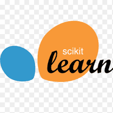
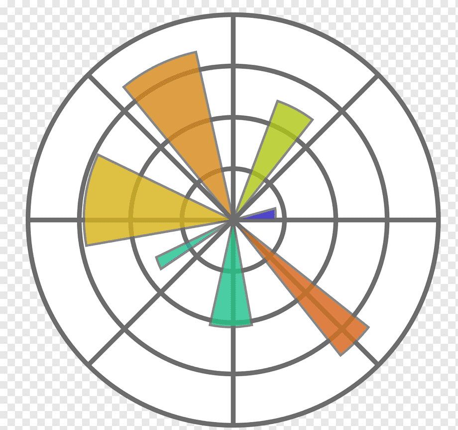

  <h1>Hi, I'm Santhosh! 👋
  
  
  
  
  </h1>

🎓 **Data Scientist** | 💼 **Senior P2P Agent at Accenture**  

I recently completed my Data Science program and have been working as a **Procure-to-Pay (P2P)** Agent at Accenture since 2016. With a strong background in both technical and business domains, I am passionate about leveraging data to drive insights and create value. 

## 🛠️ Skills 🛠️ 
- **Programming**: Python, SQL, MongoDB  
- **Data Analysis**: Pandas, NumPy, Matplotlib, Seaborn  
- **Machine Learning**: Scikit-learn
- **Version Control**: Git, GitHub
- **Tools**: Power BI, Streamlit, Jupyter Notebook,VS Code, Neovim,  

               

## 🔧 Learning 🔧

|    Deep Learning |    AWS |    Google Cloud Platform |    Azure |    Docker |
|:-------------------------------------------------:|:--------------------------------------:|:------------------------------------------------:|:------------------------------------:|:---------------------------------:|

---

## 👨‍💻 Open for Freelance Projects! 👨‍💻
I'm passionate about taking on challenging data science projects that help businesses make better decisions. Whether you need help with:

- **Data Analysis and Visualization**: Turning raw data into actionable insights.
- **Machine Learning Solutions**: Building models to solve real-world problems.  
- **Process Automation**: Leveraging analytics to streamline workflows.
- **Business Intelligence Solutions** : Interactive dashboards for monitoring and analytics.

Let's connect and discuss how I can help drive value for your business!

  
  
  

---

## Projects
### 🌟 **[Airbnb Data Analysis](https://github.com/Santhosh-Analytics/Airbnb-Analysis.git)** 
**Objective**: Developed a comprehensive data analysis solution for Airbnb listings using MongoDB Atlas, creating a **Streamlit web application** and **Power BI dashboard** for interactive visualization and actionable insights.

**Description**: This project focused on analyzing Airbnb listings to derive key insights and trends for better decision-making. The process involved:
- **Data extraction and preprocessing**: Ensured data quality and consistency from MongoDB Atlas.
- **Exploratory Data Analysis (EDA)**: Identified patterns, correlations, and actionable insights, such as pricing trends and popular locations.
- **Visualization**: Designed an interactive **Power BI dashboard** to present metrics like average pricing, booking trends, and customer preferences.
- **Streamlit Web App**: Built a user-friendly application to allow users to interactively explore the data and visualize key findings.

This project demonstrates my proficiency in working with diverse tools and my ability to deliver end-to-end analytical solutions.

**Tech Stack**: Python, Data preprocessing, EDA, Visualization, Streamlit, MongoDB, PowerBI

---

### 🌟 **[Insurance Analytics and Predictions](https://github.com/Santhosh-Analytics/Insurance_Analytics_Prediction.git)** 
**Objective**: Developed a data-driven solution for the insurance industry, including customer segmentation, churn prediction, and premium pricing optimization through machine learning models and interactive dashboards.

**Description**: 
This project aimed to uncover patterns and insights within the insurance dataset and leverage machine learning for predictive and prescriptive analytics. Key components include:

- **Customer Segmentation**: Created clustering models to group customers into meaningful segments for personalized marketing strategies and product recommendations.

- **Customer Classification**: Developed a classification model to predict whether a customer is likely to purchase a product, enabling targeted engagement.

- **Premium Prediction**: Built a regression model to predict insurance premium amounts accurately.
    - **Model Performance Metrics**:
    |                  Metric                         |            AdaBoost Regressor               |       Gradient Boosting Regressor         |       XGB Regressor       |        KNeighbors Regressor   |     |-------------------------------------------------|---------------------------------------------|-------------------------------------------|---------------------------|-------------------------------|     | **Test R2 Score**                               | 0.9574                                      | 0.9624                                    | 0.9561                    | 0.9627                        |     | **Test Mean Squared Error (MSE)**               | 141,183,511.2981                            | 124,603,332.7132                          | 145,506,323.5775          | 123,525,769.0713              |     | **Test Root Mean Squared Error (RMSE)**         | 11,882.0668                                 | 11,162.5863                               | 12,062.6002               | 11,114.2147                   |

- **Interactive Dashboard**: Designed a **Power BI dashboard** to visualize customer data, trends, and key metrics.
- **Streamlit Web App**: Created an intuitive interface where users can interact with machine learning models, making predictions and exploring data insights seamlessly.

- **Presentation and Recommendations**: Delivered actionable insights and business recommendations in a professional presentation to highlight project outcomes and strategies.

This project showcases my ability to integrate machine learning, data visualization, and practical insights into real-world business scenarios.

**Tech Stack**: Python, Machine Learning, Data preprocessing, Visualization, EDA, Streamlit, MongoDB, PowerBI.

---
## **[Other Projects Details/Readme]()**

## 💼️ A Bit More About Me 💼️
I recently completed my Data Science program. I am driven by a passion for solving complex problems through data and technology. My goal is to continuously learn and grow in the field of Data Science, while also making meaningful contributions to the organizations I work with. I believe in the power of collaboration, continuous improvement, and leveraging data to drive impactful decisions. Over the years, I've developed both technical and business skills, and my long-term aspiration is to contribute to projects that use data science to create sustainable value and improve lives.

I am currently working at Trans. Processing Sr.Analyst at Accenture Solutions Pct Ltd.
- Creating, Maintaining POs and other strategic support for dedicated business groups.
- Created & Published PBI Dashboards and Power Apps with strategic automation.

